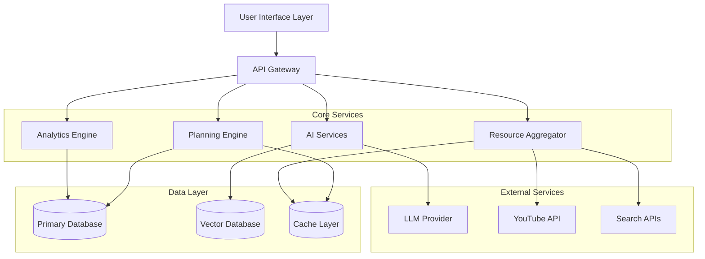
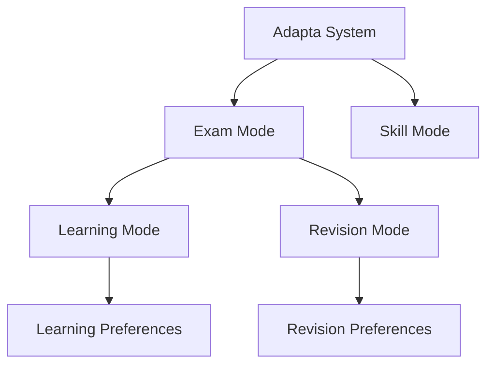

# Design Document: Adaptive Study Planner (Adapta)

## Overview

Adapta is an AI-powered adaptive study planner that generates personalized study schedules and continuously adapts them based on student performance, engagement, and well-being. The system uses machine learning for task prioritization, RAG for quiz generation and chatbot responses, and behavioral analytics for burnout detection.

The architecture follows a modular design with clear separation between:
- **Planning Engine**: Schedule generation and adaptation logic
- **AI Services**: RAG, chatbot, and prompt management
- **Analytics Engine**: Performance tracking and engagement monitoring
- **Resource Aggregation**: External content discovery and ranking
- **User Interface**: Multi-modal interaction layer with accessibility support

## Architecture

### High-Level Architecture



### Mode Hierarchy



## Components and Interfaces

### 1. Planning Engine

The Planning Engine is responsible for schedule generation, task prioritization, and dynamic replanning.

#### Core Components

**ScheduleGenerator**
- Generates initial study schedules based on syllabus, deadlines, and constraints
- Distributes topics across available time slots
- Ensures comprehensive coverage with buffer time

```typescript
interface ScheduleGenerator {
  generateSchedule(input: ScheduleInput): Schedule
  validateSchedule(schedule: Schedule): ValidationResult
}

interface ScheduleInput {
  syllabusId: string
  examDate: Date
  subjects: Subject[]
  dailyAvailability: TimeSlot[]
  difficultyRatings: Map<string, number>
  mode: PlanningMode
}

interface Schedule {
  id: string
  studentId: string
  tasks: Task[]
  startDate: Date
  endDate: Date
  mode: PlanningMode
  subMode?: SubMode
}

interface Task {
  id: string
  subject: string
  topic: string
  duration: number
  scheduledTime: Date
  priority: number
  resources: Resource[]
  status: TaskStatus
}

enum PlanningMode {
  EXAM = "exam",
  SKILL = "skill"
}

enum SubMode {
  LEARNING = "learning",
  REVISION = "revision"
}

enum TaskStatus {
  PENDING = "pending",
  IN_PROGRESS = "in_progress",
  COMPLETED = "completed",
  MISSED = "missed",
  DEFERRED = "deferred"
}
```

**PriorityCalculator**
- Calculates task priority scores using weighted factors
- Factors: exam proximity (30%), subject difficulty (20%), performance data (30%), topic dependencies (10%), engagement signals (10%)

```typescript
interface PriorityCalculator {
  calculatePriority(task: Task, context: PriorityContext): number
  recalculatePriorities(tasks: Task[], context: PriorityContext): Task[]
}

interface PriorityContext {
  examDate: Date
  currentDate: Date
  performanceData: PerformanceData
  engagementSignals: EngagementMetrics
  topicDependencies: Map<string, string[]>
}

interface PerformanceData {
  studentId: string
  topicScores: Map<string, TopicPerformance>
  overallCompletionRate: number
  recentTrend: PerformanceTrend
}

interface TopicPerformance {
  topic: string
  averageScore: number
  attemptsCount: number
  lastAttemptDate: Date
  masteryLevel: MasteryLevel
}

enum MasteryLevel {
  BEGINNER = "beginner",
  INTERMEDIATE = "intermediate",
  ADVANCED = "advanced",
  MASTERED = "mastered"
}

enum PerformanceTrend {
  IMPROVING = "improving",
  STABLE = "stable",
  DECLINING = "declining"
}
```

**AdaptiveReplanner**
- Triggers replanning based on missed tasks, performance changes, or schedule modifications
- Redistributes tasks while preserving completed work
- Implements workload adjustment strategies

```typescript
interface AdaptiveReplanner {
  shouldReplan(context: ReplanContext): boolean
  replan(schedule: Schedule, context: ReplanContext): Schedule
  adjustWorkload(schedule: Schedule, adjustment: WorkloadAdjustment): Schedule
}

interface ReplanContext {
  missedTasks: Task[]
  performanceChanges: PerformanceData
  availabilityChanges: TimeSlot[]
  deadlineChanges: Map<string, Date>
  burnoutSignals: BurnoutSignal[]
}

interface WorkloadAdjustment {
  type: AdjustmentType
  percentage: number
  reason: string
  targetDays: Date[]
}

enum AdjustmentType {
  REDUCE = "reduce",
  INCREASE = "increase",
  RESTRUCTURE = "restructure"
}

interface BurnoutSignal {
  type: SignalType
  severity: number
  detectedAt: Date
  context: string
}

enum SignalType {
  MISSED_TASKS = "missed_tasks",
  DECLINING_ENGAGEMENT = "declining_engagement",
  NEGATIVE_MOOD_PATTERN = "negative_mood_pattern",
  LOW_COMPLETION_RATE = "low_completion_rate"
}
```

### 2. AI Services

The AI Services module handles RAG-based quiz generation, chatbot interactions, and prompt management.

#### Core Components

**RAGEngine**
- Manages document ingestion and vector storage
- Retrieves relevant context for quiz generation and chatbot responses
- Supports multilingual content

```typescript
interface RAGEngine {
  ingestDocument(doc: Document, metadata: DocumentMetadata): Promise<void>
  retrieveContext(query: string, filters: RetrievalFilters): Promise<Context[]>
  generateEmbedding(text: string): Promise<number[]>
}

interface Document {
  id: string
  content: string
  language: string
  format: DocumentFormat
}

interface DocumentMetadata {
  studentId: string
  subject: string
  topic: string
  uploadedAt: Date
  examType?: string
}

enum DocumentFormat {
  PDF = "pdf",
  TEXT = "text",
  MARKDOWN = "markdown",
  HTML = "html"
}

interface RetrievalFilters {
  subject?: string
  topic?: string
  examType?: string
  maxResults: number
  similarityThreshold: number
}

interface Context {
  content: string
  source: string
  relevanceScore: number
  metadata: DocumentMetadata
}
```

**QuizGenerator**
- Generates quizzes using RAG-retrieved context
- Supports multiple question types
- Provides immediate feedback with explanations

```typescript
interface QuizGenerator {
  generateQuiz(request: QuizRequest): Promise<Quiz>
  evaluateQuiz(submission: QuizSubmission): QuizResult
}

interface QuizRequest {
  studentId: string
  topic: string
  subject: string
  questionCount: number
  difficulty: DifficultyLevel
  questionTypes: QuestionType[]
  language: string
}

enum DifficultyLevel {
  EASY = "easy",
  MEDIUM = "medium",
  HARD = "hard"
}

enum QuestionType {
  MULTIPLE_CHOICE = "multiple_choice",
  SHORT_ANSWER = "short_answer",
  TRUE_FALSE = "true_false",
  FILL_BLANK = "fill_blank"
}

interface Quiz {
  id: string
  topic: string
  questions: Question[]
  totalPoints: number
  timeLimit?: number
}

interface Question {
  id: string
  type: QuestionType
  text: string
  options?: string[]
  correctAnswer: string
  explanation: string
  points: number
}

interface QuizSubmission {
  quizId: string
  studentId: string
  answers: Map<string, string>
  submittedAt: Date
}

interface QuizResult {
  quizId: string
  score: number
  totalPoints: number
  percentage: number
  questionResults: QuestionResult[]
  feedback: string
}

interface QuestionResult {
  questionId: string
  isCorrect: boolean
  studentAnswer: string
  correctAnswer: string
  explanation: string
}
```

**Chatbot**
- Provides conversational learning support
- Uses RAG for context-aware responses
- Maintains conversation history within sessions

```typescript
interface Chatbot {
  sendMessage(message: ChatMessage): Promise<ChatResponse>
  getConversationHistory(sessionId: string): Promise<ChatMessage[]>
  clearSession(sessionId: string): Promise<void>
}

interface ChatMessage {
  sessionId: string
  studentId: string
  content: string
  timestamp: Date
  language: string
}

interface ChatResponse {
  content: string
  sources: Context[]
  confidence: number
  followUpSuggestions: string[]
}
```

**PromptManager**
- Constructs dynamic prompts based on user preferences and context
- Manages base prompts for different modes
- Injects learning preferences into AI calls

```typescript
interface PromptManager {
  constructPrompt(request: PromptRequest): string
  updateBasePrompt(mode: SubMode, prompt: string): void
  getEffectivePreferences(studentId: string, mode: SubMode): LearningPreferences
}

interface PromptRequest {
  studentId: string
  mode: SubMode
  topic: string
  context: Context[]
  userQuery?: string
}

interface LearningPreferences {
  // Learning Mode preferences
  explanationDepth?: ExplanationDepth
  problemSolvingStyle?: ProblemSolvingStyle
  languageStyle?: LanguageStyle
  examplePreference?: ExamplePreference
  analogyUsage?: AnalogyUsage
  
  // Revision Mode preferences
  summaryFormat?: SummaryFormat
  bulletPointDensity?: BulletDensity
  formulaOnlyMode?: boolean
  highYieldFocus?: boolean
}

enum ExplanationDepth {
  BASIC = "basic",
  DETAILED = "detailed",
  ADVANCED = "advanced"
}

enum ProblemSolvingStyle {
  STEP_BY_STEP = "step_by_step",
  CONCEPTUAL = "conceptual",
  FORMULA_BASED = "formula_based"
}

enum LanguageStyle {
  FORMAL = "formal",
  SIMPLE = "simple",
  BILINGUAL = "bilingual"
}

enum ExamplePreference {
  MINIMAL = "minimal",
  MODERATE = "moderate",
  EXTENSIVE = "extensive"
}

enum AnalogyUsage {
  NONE = "none",
  OCCASIONAL = "occasional",
  FREQUENT = "frequent"
}

enum SummaryFormat {
  CONCISE = "concise",
  DETAILED = "detailed"
}

enum BulletDensity {
  SPARSE = "sparse",
  MODERATE = "moderate",
  DENSE = "dense"
}
```

### 3. Analytics Engine

The Analytics Engine tracks performance, monitors engagement, and detects burnout signals.

#### Core Components

**PerformanceTracker**
- Records quiz scores and task completion
- Calculates topic-specific mastery levels
- Identifies performance trends

```typescript
interface PerformanceTracker {
  recordQuizResult(result: QuizResult): void
  recordTaskCompletion(taskId: string, completedAt: Date): void
  getPerformanceData(studentId: string): PerformanceData
  getTopicMastery(studentId: string, topic: string): TopicPerformance
}
```

**EngagementMonitor**
- Tracks login frequency, task interactions, and activity patterns
- Calculates engagement scores
- Detects declining engagement trends

```typescript
interface EngagementMonitor {
  recordActivity(activity: ActivityEvent): void
  getEngagementMetrics(studentId: string, period: TimePeriod): EngagementMetrics
  detectEngagementTrend(studentId: string): EngagementTrend
}

interface ActivityEvent {
  studentId: string
  type: ActivityType
  timestamp: Date
  metadata: Record<string, any>
}

enum ActivityType {
  LOGIN = "login",
  TASK_START = "task_start",
  TASK_COMPLETE = "task_complete",
  QUIZ_ATTEMPT = "quiz_attempt",
  CHAT_MESSAGE = "chat_message",
  NOTE_CREATED = "note_created",
  RESOURCE_ACCESSED = "resource_accessed"
}

interface EngagementMetrics {
  loginFrequency: number
  taskCompletionRate: number
  averageSessionDuration: number
  consecutiveInactiveDays: number
  engagementScore: number
}

enum EngagementTrend {
  INCREASING = "increasing",
  STABLE = "stable",
  DECLINING = "declining",
  CRITICAL = "critical"
}

interface TimePeriod {
  startDate: Date
  endDate: Date
}
```

**BurnoutDetector**
- Analyzes multiple signals to detect burnout risk
- Triggers workload adjustments
- Correlates mood data with performance

```typescript
interface BurnoutDetector {
  analyzeBurnoutRisk(studentId: string): BurnoutAssessment
  detectSignals(studentId: string): BurnoutSignal[]
  shouldTriggerIntervention(assessment: BurnoutAssessment): boolean
}

interface BurnoutAssessment {
  studentId: string
  riskLevel: RiskLevel
  signals: BurnoutSignal[]
  recommendedActions: InterventionAction[]
  assessedAt: Date
}

enum RiskLevel {
  LOW = "low",
  MODERATE = "moderate",
  HIGH = "high",
  CRITICAL = "critical"
}

interface InterventionAction {
  type: InterventionType
  description: string
  priority: number
}

enum InterventionType {
  REDUCE_WORKLOAD = "reduce_workload",
  ADD_BREAKS = "add_breaks",
  RESTRUCTURE_SCHEDULE = "restructure_schedule",
  SEND_SUPPORT_MESSAGE = "send_support_message",
  SUGGEST_REST_DAY = "suggest_rest_day"
}
```

**MoodTracker**
- Records daily mood inputs
- Identifies mood patterns and trends
- Correlates mood with performance and engagement

```typescript
interface MoodTracker {
  recordMood(entry: MoodEntry): void
  getMoodHistory(studentId: string, period: TimePeriod): MoodEntry[]
  analyzeMoodTrend(studentId: string): MoodTrend
  correlateMoodWithPerformance(studentId: string): CorrelationAnalysis
}

interface MoodEntry {
  studentId: string
  value: number // 1-5 scale
  timestamp: Date
  notes?: string
}

interface MoodTrend {
  direction: TrendDirection
  averageValue: number
  volatility: number
  consecutiveLowDays: number
}

enum TrendDirection {
  IMPROVING = "improving",
  STABLE = "stable",
  DECLINING = "declining"
}

interface CorrelationAnalysis {
  moodPerformanceCorrelation: number
  moodEngagementCorrelation: number
  insights: string[]
}
```

### 4. Resource Aggregator

The Resource Aggregator discovers, ranks, and caches external learning resources.

#### Core Components

**ResourceFetcher**
- Fetches resources from multiple external APIs
- Filters and ranks results by relevance
- Caches results for performance

```typescript
interface ResourceFetcher {
  fetchResources(request: ResourceRequest): Promise<Resource[]>
  rankResources(resources: Resource[], context: RankingContext): Resource[]
  cacheResources(taskId: string, resources: Resource[]): void
}

interface ResourceRequest {
  topic: string
  subject: string
  examType?: string
  resourceTypes: ResourceType[]
  maxResults: number
  language: string
}

enum ResourceType {
  VIDEO = "video",
  ARTICLE = "article",
  SEARCH_LINK = "search_link",
  BOOK = "book"
}

interface Resource {
  id: string
  type: ResourceType
  title: string
  url: string
  description: string
  source: string
  relevanceScore: number
  engagementScore?: number
  duration?: number
  language: string
}

interface RankingContext {
  studentPerformance: TopicPerformance
  previousEngagement: ResourceEngagement[]
  examType?: string
}

interface ResourceEngagement {
  resourceId: string
  studentId: string
  accessedAt: Date
  timeSpent: number
  wasHelpful?: boolean
}
```

**SyllabusManager**
- Manages syllabus database for major exams
- Supports auto-loading and customization
- Handles syllabus updates

```typescript
interface SyllabusManager {
  getSyllabus(examType: string): Promise<Syllabus | null>
  listAvailableExams(): Promise<ExamInfo[]>
  customizeSyllabus(syllabusId: string, changes: SyllabusChanges): Promise<Syllabus>
  updateSyllabus(examType: string, syllabus: Syllabus): Promise<void>
}

interface Syllabus {
  id: string
  examType: string
  examName: string
  version: string
  lastUpdated: Date
  subjects: Subject[]
}

interface Subject {
  id: string
  name: string
  topics: Topic[]
  weightage?: number
}

interface Topic {
  id: string
  name: string
  subtopics: string[]
  difficulty: DifficultyLevel
  estimatedHours: number
  dependencies: string[]
}

interface ExamInfo {
  examType: string
  examName: string
  description: string
  syllabusAvailable: boolean
}

interface SyllabusChanges {
  addedTopics: Topic[]
  removedTopicIds: string[]
  modifiedTopics: Partial<Topic>[]
}
```

### 5. Notification Service

Handles email notifications for reminders, updates, and milestones.

```typescript
interface NotificationService {
  sendDailySummary(studentId: string, tasks: Task[]): Promise<void>
  sendReplanNotification(studentId: string, changes: ScheduleChanges): Promise<void>
  sendStreakMilestone(studentId: string, streak: number): Promise<void>
  sendBurnoutSupport(studentId: string, assessment: BurnoutAssessment): Promise<void>
  updatePreferences(studentId: string, prefs: NotificationPreferences): Promise<void>
}

interface ScheduleChanges {
  addedTasks: Task[]
  removedTasks: Task[]
  modifiedTasks: Task[]
  reason: string
}

interface NotificationPreferences {
  dailySummary: boolean
  replanAlerts: boolean
  streakMilestones: boolean
  burnoutSupport: boolean
  emailFrequency: EmailFrequency
}

enum EmailFrequency {
  IMMEDIATE = "immediate",
  DAILY_DIGEST = "daily_digest",
  WEEKLY_DIGEST = "weekly_digest"
}
```

### 6. User Interface Layer

Provides multi-modal interaction with accessibility support.

```typescript
interface UIController {
  renderDashboard(studentId: string): DashboardView
  renderTaskList(studentId: string, date: Date): TaskListView
  renderInsights(studentId: string, period: TimePeriod): InsightsView
  handleVoiceCommand(command: VoiceCommand): Promise<CommandResult>
  applyAccessibilityMode(mode: AccessibilityMode): void
}

interface DashboardView {
  todayTasks: Task[]
  streak: number
  upcomingDeadlines: Deadline[]
  recentPerformance: PerformanceSummary
  moodPrompt: boolean
}

interface TaskListView {
  tasks: Task[]
  sortedByPriority: boolean
  groupedBySubject: boolean
}

interface InsightsView {
  totalStudyTime: number
  topicsCovered: number
  averageQuizScore: number
  completionRate: number
  performanceCharts: Chart[]
  streakHistory: StreakData[]
}

interface VoiceCommand {
  studentId: string
  transcript: string
  language: string
  timestamp: Date
}

interface CommandResult {
  success: boolean
  action: string
  response: string
}

enum AccessibilityMode {
  KEYBOARD_NAVIGATION = "keyboard_navigation",
  SIMPLIFIED_UI = "simplified_ui",
  VOICE_INPUT = "voice_input",
  FOCUS_MODE = "focus_mode",
  HIGH_CONTRAST = "high_contrast",
  SCREEN_READER = "screen_reader"
}
```

## Data Models

### Core Entities

**Student**
```typescript
interface Student {
  id: string
  email: string
  name: string
  language: string
  timezone: string
  learningPreferences: LearningPreferences
  notificationPreferences: NotificationPreferences
  accessibilitySettings: AccessibilityMode[]
  createdAt: Date
  lastActiveAt: Date
}
```

**StudySession**
```typescript
interface StudySession {
  id: string
  studentId: string
  taskId: string
  startTime: Date
  endTime?: Date
  duration: number
  resourcesAccessed: string[]
  chatMessages: number
  completed: boolean
}
```

**Streak**
```typescript
interface Streak {
  studentId: string
  currentStreak: number
  longestStreak: number
  lastCompletionDate: Date
  milestones: StreakMilestone[]
}

interface StreakMilestone {
  days: number
  achievedAt: Date
}
```

**Note**
```typescript
interface Note {
  id: string
  studentId: string
  subject: string
  topic: string
  content: string
  format: NoteFormat
  createdAt: Date
  updatedAt: Date
  tags: string[]
}

enum NoteFormat {
  PLAIN_TEXT = "plain_text",
  MARKDOWN = "markdown",
  RICH_TEXT = "rich_text"
}
```

### Database Schema Considerations

**Primary Database (PostgreSQL)**
- Students, Schedules, Tasks, Performance Data
- Relational structure for transactional consistency
- Indexed on studentId, date, and status fields

**Vector Database (Pinecone/Weaviate)**
- Document embeddings for RAG
- Indexed by subject, topic, and exam type
- Supports multilingual semantic search

**Cache Layer (Redis)**
- Resource fetch results (TTL: 24 hours)
- Active schedules (TTL: 1 hour)
- Engagement metrics (TTL: 15 minutes)


## Correctness Properties

A property is a characteristic or behavior that should hold true across all valid executions of a system—essentially, a formal statement about what the system should do. Properties serve as the bridge between human-readable specifications and machine-verifiable correctness guarantees.

### Property 1: Complete Syllabus Coverage

*For any* syllabus, exam deadline, and availability constraints, when a schedule is generated in Exam_Mode, all topics from the syllabus should appear in the generated schedule with completion times before the exam deadline.

**Validates: Requirements 1.1, 1.5**

### Property 2: Availability Constraint Respect

*For any* generated schedule and daily availability windows, all scheduled tasks should fall within the specified availability time slots with no tasks scheduled outside these windows.

**Validates: Requirements 1.2**

### Property 3: Priority Ordering Consistency

*For any* set of tasks with calculated priority scores, when tasks are displayed or processed, they should be ordered from highest to lowest priority score, and this ordering should be consistent with the priority factors (exam proximity, difficulty, performance, dependencies).

**Validates: Requirements 1.3, 15.1, 15.2**

### Property 4: Task Duration Bounds

*For any* generated task, the assigned duration should fall within reasonable bounds (15 to 180 minutes) based on topic complexity and student proficiency level.

**Validates: Requirements 1.4**

### Property 5: Mode Hierarchy Enforcement

*For any* system state, Learning_Mode and Revision_Mode should only be accessible when the system is in Exam_Mode, and attempting to access these sub-modes from Skill_Mode should fail.

**Validates: Requirements 2.2, 2.7**

### Property 6: Progress Preservation Across Mode Switches

*For any* student with existing progress data (completed tasks, quiz scores, notes), switching between Exam_Mode and Skill_Mode should preserve all progress data without loss or corruption.

**Validates: Requirements 2.6**

### Property 7: Performance Data Recording

*For any* completed quiz, the system should record the score, topic-specific accuracy, and timestamp in Performance_Data, and this data should be retrievable for future planning decisions.

**Validates: Requirements 3.1, 7.5**

### Property 8: Adaptive Task Allocation

*For any* topic with performance data, there should be an inverse relationship between quiz scores and future task allocation—low-scoring topics should receive more tasks, and high-scoring topics should receive fewer tasks in subsequent schedules.

**Validates: Requirements 3.2, 3.3**

### Property 9: Engagement Signal Tracking

*For any* student activity event (login, task start, task completion, chat message), the system should record the event with accurate timestamp and metadata, and these signals should be retrievable for engagement analysis.

**Validates: Requirements 4.1**

### Property 10: Declining Engagement Workload Reduction

*For any* student showing declining engagement patterns (reduced login frequency, lower completion rates), the system should reduce daily workload by 20-30% compared to the baseline workload.

**Validates: Requirements 4.3**

### Property 11: Burnout-Triggered Schedule Restructuring

*For any* schedule that undergoes restructuring due to multiple burnout signals, the restructured schedule should contain more break periods and shorter average task durations compared to the original schedule.

**Validates: Requirements 4.4**

### Property 12: Workload Recovery Gradualness

*For any* student whose engagement signals return to normal after a period of decline, workload increases should be gradual (no more than 10-15% per day) rather than immediate jumps back to optimal levels.

**Validates: Requirements 4.5**

### Property 13: Mood-Performance Correlation Storage

*For any* student with mood history and performance data, the system should store both datasets and maintain their temporal correlation for use in future planning decisions.

**Validates: Requirements 5.5**

### Property 14: Missed Task Redistribution

*For any* set of missed tasks, when replanning occurs, all missed tasks should appear in future time slots within the schedule, and no missed tasks should be lost or dropped.

**Validates: Requirements 6.1**

### Property 15: Deadline-Based Schedule Regeneration

*For any* schedule with a modified exam deadline, the regenerated schedule should accommodate the new timeline with all tasks rescheduled to complete before the updated deadline.

**Validates: Requirements 6.2**

### Property 16: Availability-Based Replanning

*For any* schedule with changed daily availability, all future (non-completed) tasks should be rescheduled to fit within the new availability constraints.

**Validates: Requirements 6.3**

### Property 17: Replanning Invariant - Completed Task Preservation

*For any* replanning operation (triggered by missed tasks, deadline changes, or availability changes), completed tasks should never be modified, removed, or rescheduled—only pending tasks should be adjusted.

**Validates: Requirements 6.4**

### Property 18: Replanning Notification

*For any* significant replanning event (affecting more than 3 tasks or changing schedule by more than 1 day), the system should send a notification to the student with a summary of changes including added, removed, and modified tasks.

**Validates: Requirements 6.5**

### Property 19: Study Material Round-Trip

*For any* study material uploaded by a student, storing the material and then retrieving it should return content that is equivalent to the original upload (accounting for format normalization).

**Validates: Requirements 7.1**

### Property 20: RAG-Based Quiz Content

*For any* quiz generated for a topic with uploaded study materials, the quiz questions should contain content or concepts that appear in the uploaded materials, demonstrating that RAG retrieval was used.

**Validates: Requirements 7.2**

### Property 21: Quiz Question Type Diversity

*For any* generated quiz with multiple questions, the quiz should contain at least two different question types from the set {multiple choice, short answer, true/false, fill blank} when the requested count allows.

**Validates: Requirements 7.3**

### Property 22: Quiz Feedback Completeness

*For any* completed quiz, the quiz result should include correct answers, student answers, correctness indicators, and explanations for all questions.

**Validates: Requirements 7.4**

### Property 23: Chatbot Material Referencing

*For any* chatbot response to a question about a topic with uploaded study materials, the response should reference or cite content from those materials, demonstrating RAG usage.

**Validates: Requirements 8.2**

### Property 24: Chatbot Context Maintenance

*For any* study session with multiple chatbot interactions, follow-up questions should receive responses that reference previous messages in the conversation, demonstrating context preservation.

**Validates: Requirements 8.4**

### Property 25: Multilingual Response Consistency

*For any* chatbot query, quiz generation, or interface element, when a student's language preference is set to a supported language, all generated content should be in that language.

**Validates: Requirements 8.5, 12.2, 12.3, 12.4**

### Property 26: Note CRUD Operations

*For any* note, the system should support creating, reading, updating, and deleting the note, with each operation preserving data integrity and maintaining correct associations with subject and topic.

**Validates: Requirements 9.1**

### Property 27: Note Metadata Association

*For any* created note with subject and topic metadata, retrieving notes by that subject or topic should return the note in the results.

**Validates: Requirements 9.2**

### Property 28: Note Formatting Preservation

*For any* note with rich text formatting (headings, lists, highlighting), storing and retrieving the note should preserve the formatting without loss or corruption.

**Validates: Requirements 9.3**

### Property 29: Note Search Accuracy

*For any* note containing a specific keyword, searching for that keyword should return the note in the search results.

**Validates: Requirements 9.4**

### Property 30: Contextual Note Surfacing

*For any* revision task with an associated topic, when the task is displayed, any notes tagged with that topic should be surfaced alongside the task.

**Validates: Requirements 9.5**

### Property 31: Streak Calculation Correctness

*For any* sequence of days with task completion data, the streak count should equal the number of consecutive days (ending with the current day) where at least one task was completed, and should reset to zero after any day with zero completions.

**Validates: Requirements 10.1, 10.2, 10.3**

### Property 32: Insights Metric Completeness

*For any* time period with student activity, the generated insights should include all required metrics: total study time, topics covered count, average quiz score, and completion rate.

**Validates: Requirements 10.4**

### Property 33: Daily Email Task Summary

*For any* day with scheduled tasks, the system should send a daily email to the student containing a summary of all tasks scheduled for that day.

**Validates: Requirements 11.1**

### Property 34: Replanning Email Notification

*For any* replanning event, the system should send an email notification with a summary of schedule changes.

**Validates: Requirements 11.2**

### Property 35: Burnout Support Email

*For any* detected burnout signal with high or critical risk level, the system should send a supportive email with information about workload adjustments.

**Validates: Requirements 11.5**

### Property 36: Notification Preference Respect

*For any* student with configured notification preferences, the system should only send emails of types that are enabled in the preferences, and should respect the configured frequency.

**Validates: Requirements 11.4**

### Property 37: Language Switching Safety

*For any* student data (schedules, notes, preferences, performance data), switching the interface language should preserve all data without loss or corruption.

**Validates: Requirements 12.5**

### Property 38: Keyboard Navigation Completeness

*For any* interactive UI element, the element should be reachable and operable using only keyboard inputs, with visible focus indicators showing the current focus position.

**Validates: Requirements 13.1**

### Property 39: Voice Command Execution

*For any* supported voice command (task completion, mood input, chatbot query), the system should correctly parse the command and execute the corresponding action.

**Validates: Requirements 13.3**

### Property 40: Data Persistence Across Sessions

*For any* student data (schedules, performance data, notes, preferences), the data should persist across system restarts and be available in subsequent sessions.

**Validates: Requirements 14.1**

### Property 41: Offline-Online Synchronization

*For any* changes made while offline (task completions, note edits), when connectivity is restored, those changes should synchronize to the server and be reflected in the student's data.

**Validates: Requirements 14.4**

### Property 42: Conflict Resolution Recency

*For any* synchronization conflict where the same data was modified both online and offline, the system should preserve the change with the most recent timestamp.

**Validates: Requirements 14.5**

### Property 43: Priority Factor Incorporation

*For any* calculated task priority score, the score should demonstrably incorporate all specified factors: exam proximity (30% weight), subject difficulty (20% weight), performance data (30% weight), topic dependencies (10% weight), and engagement signals (10% weight).

**Validates: Requirements 15.1**

### Property 44: Workload Reduction Priority Ordering

*For any* workload reduction operation, the tasks that are deferred should have lower priority scores than the tasks that are retained.

**Validates: Requirements 15.3**

### Property 45: High-Priority Topic Review Frequency

*For any* high-priority topic (priority score in top 20%), the schedule should include at least 2 review sessions for that topic before the exam date.

**Validates: Requirements 15.4**

### Property 46: Struggling Topic Priority Elevation

*For any* topic where a student has consistently low performance (average score below 50% over 3+ attempts), the topic's priority should be elevated to the high-priority range regardless of other factors.

**Validates: Requirements 15.5**

### Property 47: Resource Attachment and Diversity

*For any* generated task, the task should have attached learning resources, and when available, should include at least 3 different resource types (videos, articles, search links, books).

**Validates: Requirements 16.1, 16.6**

### Property 48: Resource Ranking by Relevance

*For any* set of resources attached to a task, the resources should be ordered by relevance score, with higher-scoring resources appearing first.

**Validates: Requirements 16.2**

### Property 49: Performance-Matched Resource Selection

*For any* student with established performance history, the resources attached to tasks should match the student's mastery level (beginner resources for beginners, advanced for advanced).

**Validates: Requirements 16.3**

### Property 50: Book Recommendation Availability

*For any* topic where book resources are available in the resource database, the system should include at least one book recommendation in the task's resources.

**Validates: Requirements 16.4**

### Property 51: Resource Engagement Tracking and Adaptation

*For any* resource accessed by a student, the system should record engagement data (time spent, helpfulness rating), and resources with higher engagement should be prioritized in future recommendations for similar topics.

**Validates: Requirements 16.5**

### Property 52: Auto-Loaded Syllabus Completeness

*For any* recognized exam selected from the syllabus database, the auto-loaded syllabus should include all official subjects and topics for that exam, with each topic tagged with subject classification and difficulty level.

**Validates: Requirements 17.2, 17.3**

### Property 53: Syllabus Customization Operations

*For any* auto-loaded or manually entered syllabus, the system should support adding new topics, removing existing topics, and modifying topic properties, with all changes persisted correctly.

**Validates: Requirements 17.4**

### Property 54: Syllabus Update Notification

*For any* student using a syllabus from the database, when an updated version of that syllabus becomes available, the system should send a notification informing the student of the update.

**Validates: Requirements 17.5**

### Property 55: Learning Preference Storage and Retrieval

*For any* student in Learning_Mode, all configured learning preferences (explanation depth, problem-solving style, language formality, example preference, analogy usage) should be stored in the student profile and retrievable for use in AI interactions.

**Validates: Requirements 18.1, 18.3**

### Property 56: Revision Preference Storage and Retrieval

*For any* student in Revision_Mode, all configured revision preferences (summary format, bullet-point density, formula-only option, high-yield focus) should be stored in the student profile and retrievable for use in AI interactions.

**Validates: Requirements 18.2, 18.3**

### Property 57: Immediate Preference Application

*For any* preference modification, subsequent AI interactions (chatbot responses, quiz generation, revision content) should reflect the updated preferences without requiring system restart or re-login.

**Validates: Requirements 18.4**

### Property 58: Preference Editing Safety

*For any* preference modification operation, changing one preference should not cause loss or corruption of other preferences or student data.

**Validates: Requirements 18.5**

### Property 59: Prompt Construction Completeness

*For any* AI interaction (chatbot query, quiz generation, revision content), the constructed prompt should include all required components: base system prompt, student's learning/revision preferences, topic context, and RAG-retrieved knowledge.

**Validates: Requirements 18.6, 18.7, 19.2**

### Property 60: Dynamic Preference Updates

*For any* preference change, the prompt construction system should incorporate the new preferences immediately without requiring system restart, and subsequent prompts should reflect the changes.

**Validates: Requirements 19.4**

## Error Handling

### Error Categories

**1. Input Validation Errors**
- Invalid date ranges (exam date before current date)
- Insufficient daily availability (less than 30 minutes per day)
- Empty syllabus or missing required fields
- Invalid mood values (outside 1-5 range)
- Malformed study materials (corrupted files, unsupported formats)

**Error Response**: Return descriptive error messages with specific field violations. HTTP 400 for client errors.

**2. Resource Availability Errors**
- External API failures (YouTube, search APIs)
- LLM service unavailability
- Vector database connection failures
- Cache service unavailability

**Error Response**: Implement graceful degradation. For resource fetching, return cached results or generic search links. For LLM failures, queue requests for retry. HTTP 503 for service unavailability.

**3. Data Consistency Errors**
- Synchronization conflicts during offline-online sync
- Concurrent schedule modifications
- Missing referenced entities (deleted topics, removed tasks)

**Error Response**: Use conflict resolution strategies (most recent wins for sync conflicts). Implement optimistic locking for concurrent modifications. Return HTTP 409 for conflicts.

**4. Scheduling Impossibility Errors**
- Cannot fit all topics within available time before deadline
- No available time slots for task redistribution
- Circular topic dependencies

**Error Response**: Notify user with specific constraint violations. Suggest adjustments (extend deadline, increase availability, reduce syllabus scope). HTTP 422 for unprocessable requests.

**5. Authentication and Authorization Errors**
- Invalid credentials
- Expired sessions
- Unauthorized access to other students' data

**Error Response**: Return generic authentication errors without revealing user existence. HTTP 401 for authentication failures, HTTP 403 for authorization failures.

### Error Recovery Strategies

**Retry with Exponential Backoff**
- Applied to: External API calls, LLM requests, database operations
- Configuration: Initial delay 100ms, max delay 5s, max attempts 3

**Circuit Breaker Pattern**
- Applied to: External service calls (YouTube API, search APIs, LLM)
- Configuration: Open after 5 consecutive failures, half-open after 30s, close after 2 successes

**Fallback Mechanisms**
- Resource fetching: Use cached results → generic search links → manual resource addition
- Quiz generation: Use cached questions → simpler question types → manual quiz creation
- Chatbot: Use cached responses → general knowledge → "materials insufficient" message

**Data Validation**
- Validate all inputs at API boundary
- Sanitize user-provided content before storage
- Verify data integrity before critical operations (scheduling, replanning)

**Logging and Monitoring**
- Log all errors with context (student ID, operation, timestamp)
- Track error rates and patterns
- Alert on critical errors (data loss, security violations)

## Testing Strategy

### Dual Testing Approach

The testing strategy employs both unit testing and property-based testing as complementary approaches:

**Unit Tests**: Focus on specific examples, edge cases, and error conditions
- Integration points between components
- Specific error scenarios (invalid inputs, service failures)
- Edge cases (empty syllabi, single-day deadlines, zero availability)
- Mode transitions and state changes
- Notification triggers and content

**Property-Based Tests**: Verify universal properties across all inputs
- Generate random schedules, syllabi, performance data, and constraints
- Test properties hold for 100+ randomized iterations per property
- Each property test references its design document property
- Tag format: `Feature: adaptive-study-planner, Property {number}: {property_text}`

### Property-Based Testing Configuration

**Testing Library**: Use `fast-check` for TypeScript/JavaScript, `Hypothesis` for Python, or `QuickCheck` for Haskell

**Test Configuration**:
- Minimum 100 iterations per property test
- Seed randomization for reproducibility
- Shrinking enabled to find minimal failing cases
- Timeout: 30 seconds per property test

**Generator Strategy**:
- Create custom generators for domain objects (Schedule, Task, Student, Performance Data)
- Ensure generated data respects domain constraints (dates in order, valid enums)
- Generate edge cases (empty lists, boundary values, extreme dates)
- Include multilingual test data for language support properties

### Test Coverage Goals

- Unit test coverage: 80% of code paths
- Property test coverage: 100% of correctness properties (all 60 properties)
- Integration test coverage: All API endpoints and service interactions
- Accessibility test coverage: All UI components with automated tools (axe-core)

### Testing Phases

**Phase 1: Component Testing**
- Test individual components in isolation
- Mock external dependencies (LLM, APIs, databases)
- Focus on business logic correctness

**Phase 2: Integration Testing**
- Test component interactions
- Use test databases and mock external services
- Verify data flow between layers

**Phase 3: Property-Based Testing**
- Implement all 60 correctness properties as property tests
- Run with high iteration counts (100-1000)
- Verify properties hold across randomized inputs

**Phase 4: End-to-End Testing**
- Test complete user workflows
- Use staging environment wi