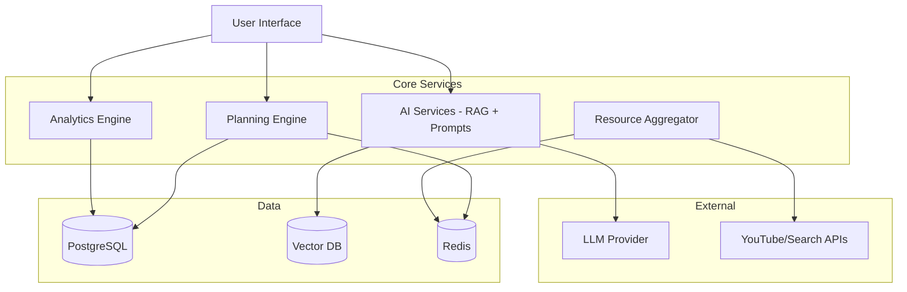

# Design Document: Adaptive Study Planner (Adapta)

## Overview

Adapta is an AI-powered adaptive study planner that generates personalized study schedules and continuously adapts them based on student performance, engagement, and well-being.

**Core Innovation**: Combines RAG-based learning, adaptive scheduling algorithms, and behavioral analytics to create a truly personalized study experience that prevents burnout while maximizing learning outcomes.

**Key Features**:
- Adaptive schedule generation with automatic replanning
- RAG-powered quiz generation and chatbot from student materials
- Burnout detection and workload adjustment
- Dynamic prompt management based on learning preferences
- Multi-modal accessibility (voice, keyboard, simplified UI)

## Architecture

### System Architecture



**Mode Hierarchy**: Exam Mode (Learning/Revision sub-modes) | Skill Mode

## Core Components

### 1. Planning Engine

**Responsibilities**: Schedule generation, task prioritization, adaptive replanning

**Key Algorithms**:
- **Priority Scoring**: Weighted factors (exam proximity 30%, difficulty 20%, performance 30%, dependencies 10%, engagement 10%)
- **Schedule Generation**: Distributes syllabus topics across available time slots before exam deadline
- **Adaptive Replanning**: Triggers on missed tasks, performance changes, or burnout signals

**Core Interfaces**:
```typescript
interface ScheduleGenerator {
  generateSchedule(input: ScheduleInput): Schedule
}

interface ScheduleInput {
  syllabusId: string
  examDate: Date
  subjects: Subject[]
  dailyAvailability: TimeSlot[]
  mode: PlanningMode // EXAM or SKILL
}

interface Task {
  id: string
  subject: string
  topic: string
  duration: number
  scheduledTime: Date
  priority: number
  resources: Resource[]
  status: TaskStatus
}
```

**Replanning Triggers**:
- Missed tasks accumulate
- Performance drops significantly
- Burnout signals detected
- User modifies deadline or availability

### 2. AI Services

**Responsibilities**: RAG-based content generation, chatbot, prompt management

**RAG Pipeline**:
1. Student uploads study materials (PDF, text, markdown)
2. Documents chunked and embedded into vector database
3. Queries retrieve relevant context for quiz/chat generation
4. LLM generates content using retrieved context

**Core Interfaces**:
```typescript
interface RAGEngine {
  ingestDocument(doc: Document, metadata: DocumentMetadata): Promise<void>
  retrieveContext(query: string, filters: RetrievalFilters): Promise<Context[]>
}

interface QuizGenerator {
  generateQuiz(request: QuizRequest): Promise<Quiz>
  // Supports: multiple choice, short answer, true/false, fill-in-blank
}

interface Chatbot {
  sendMessage(message: ChatMessage): Promise<ChatResponse>
  // Uses RAG context + conversation history
}
```

**Prompt Management**:
- Base prompts for Learning Mode vs Revision Mode
- Dynamic injection of student preferences:
  - **Learning**: explanation depth, problem-solving style, example preference, analogy usage
  - **Revision**: summary format, bullet density, formula-only mode, high-yield focus
- Multilingual support (prompts adapt to student language)

### 3. Analytics Engine

**Responsibilities**: Performance tracking, engagement monitoring, burnout detection

**Key Metrics**:
- **Performance**: Quiz scores, topic mastery levels, completion rates
- **Engagement**: Login frequency, session duration, task interaction patterns
- **Burnout Signals**: Missed tasks, declining engagement, negative mood patterns, low completion rates

**Burnout Detection Algorithm**:
```typescript
interface BurnoutDetector {
  analyzeBurnoutRisk(studentId: string): BurnoutAssessment
}

interface BurnoutAssessment {
  riskLevel: RiskLevel // LOW, MODERATE, HIGH, CRITICAL
  signals: BurnoutSignal[]
  recommendedActions: InterventionAction[]
}

// Interventions: reduce workload 20-30%, add breaks, restructure schedule, send support message
```

**Mood Tracking**:
- Daily mood input (1-5 scale)
- Correlates mood with performance and engagement
- Informs burnout detection

### 4. Resource Aggregator

**Responsibilities**: Fetch and rank external learning resources

**Resource Types**: Videos (YouTube), articles, search links, books

**Ranking Strategy**:
- Relevance to topic
- Student performance level (beginner vs advanced)
- Previous engagement data (time spent, helpfulness ratings)

**Caching**: 24-hour TTL for resource fetch results

### 5. Notification Service

**Email Notifications**:
- Daily task summary
- Replanning alerts
- Streak milestones
- Burnout support messages

**Configurable Preferences**: Frequency (immediate, daily digest, weekly digest), notification types

## Data Models

### Core Entities

```typescript
interface Student {
  id: string
  email: string
  name: string
  language: string
  timezone: string
  learningPreferences: LearningPreferences
  accessibilitySettings: AccessibilityMode[]
}

interface Schedule {
  id: string
  studentId: string
  tasks: Task[]
  mode: PlanningMode // EXAM or SKILL
  subMode?: SubMode // LEARNING or REVISION
}

interface Task {
  id: string
  subject: string
  topic: string
  duration: number
  scheduledTime: Date
  priority: number
  resources: Resource[]
  status: TaskStatus // PENDING, IN_PROGRESS, COMPLETED, MISSED
}

interface PerformanceData {
  studentId: string
  topicScores: Map<string, TopicPerformance>
  overallCompletionRate: number
}

interface Note {
  id: string
  studentId: string
  subject: string
  topic: string
  content: string
  tags: string[]
}

interface Streak {
  studentId: string
  currentStreak: number
  longestStreak: number
  lastCompletionDate: Date
}
```

### Database Schema

**PostgreSQL** (Primary Database):
- Students, Schedules, Tasks, Performance, Notes, Streaks
- Indexed on: studentId, date, status

**Vector Database** (Pinecone/Weaviate):
- Document embeddings for RAG
- Indexed by: subject, topic, exam type
- Supports multilingual semantic search

**Redis** (Cache):
- Resource fetch results (TTL: 24h)
- Active schedules (TTL: 1h)
- Engagement metrics (TTL: 15min)
## Key Data Flows

### 1. Schedule Generation Flow
```
User Input (syllabus, deadline, availability) 
  → Planning Engine calculates priorities
  → Generates task list with resources
  → Stores in DB + caches
  → Returns schedule to UI
```

### 2. RAG-Based Quiz Flow
```
User requests quiz on topic
  → RAG retrieves relevant context from uploaded materials
  → Prompt Manager injects learning preferences
  → LLM generates questions with explanations
  → Quiz stored and returned to UI
  → Results recorded in Performance Tracker
```

### 3. Adaptive Replanning Flow
```
Analytics Engine detects trigger (missed tasks, burnout, performance drop)
  → Planning Engine recalculates priorities
  → Redistributes pending tasks
  → Adjusts workload if needed
  → Sends notification
  → Updates schedule in DB
```

### 4. Burnout Detection Flow
```
Engagement Monitor tracks activity patterns
  → Mood Tracker records daily mood
  → Burnout Detector analyzes signals
  → If risk detected: trigger workload reduction
  → Planning Engine restructures schedule
  → Send support notification
```

## Correctness Properties

*A property is a characteristic that should hold true across all valid executions—a formal statement about what the system should do.*

### Critical Properties (Property-Based Testing)

**Property 1: Complete Syllabus Coverage**
*For any* syllabus and exam deadline, all topics should appear in the generated schedule with completion before the deadline.
**Validates: Requirements 1.1, 1.5**

**Property 2: Availability Constraint Respect**
*For any* schedule, all tasks should fall within specified availability windows.
**Validates: Requirements 1.2**

**Property 3: Priority Ordering Consistency**
*For any* task set, tasks should be ordered by priority score (exam proximity 30%, difficulty 20%, performance 30%, dependencies 10%, engagement 10%).
**Validates: Requirements 1.3, 15.1**

**Property 4: Replanning Preserves Completed Tasks**
*For any* replanning operation, completed tasks should never be modified or removed.
**Validates: Requirements 6.4**

**Property 5: RAG Material Round-Trip**
*For any* uploaded study material, storing then retrieving should return equivalent content.
**Validates: Requirements 7.1**

**Property 6: Quiz Uses RAG Context**
*For any* quiz on a topic with uploaded materials, questions should reference content from those materials.
**Validates: Requirements 7.2**

**Property 7: Burnout Triggers Workload Reduction**
*For any* student with declining engagement, workload should reduce by 20-30%.
**Validates: Requirements 4.3**

**Property 8: Mood-Performance Correlation Storage**
*For any* student with mood and performance data, both datasets should be stored with temporal correlation.
**Validates: Requirements 5.5**

**Property 9: Missed Task Redistribution**
*For any* missed tasks, replanning should redistribute all of them to future slots.
**Validates: Requirements 6.1**

**Property 10: Preference Application Immediacy**
*For any* preference change, subsequent AI interactions should reflect the update immediately.
**Validates: Requirements 18.4**

**Property 11: Multilingual Consistency**
*For any* student language preference, all generated content should match that language.
**Validates: Requirements 12.2, 12.3**

**Property 12: Streak Calculation Correctness**
*For any* completion sequence, streak should equal consecutive days with ≥1 completion, resetting after zero-completion days.
**Validates: Requirements 10.1, 10.2**

## Error Handling

### Error Categories & Responses

**Input Validation Errors**
- Invalid dates, insufficient availability, empty syllabus, malformed files
- Response: Descriptive error messages, HTTP 400

**External Service Failures**
- API failures (YouTube, search), LLM unavailability, database connection issues
- Response: Graceful degradation, use cached results, retry with exponential backoff, HTTP 503

**Data Consistency Errors**
- Sync conflicts, concurrent modifications, missing references
- Response: Most recent timestamp wins, optimistic locking, HTTP 409

**Scheduling Impossibility**
- Cannot fit topics before deadline, no available slots, circular dependencies
- Response: Notify user with constraint violations, suggest adjustments, HTTP 422

### Recovery Strategies

- Retry with exponential backoff (100ms initial, 5s max, 3 attempts)
- Circuit breaker for external services (open after 5 failures, half-open after 30s)
- Fallback: cached results → generic links → manual input
- Comprehensive logging with context (studentId, operation, timestamp)

## Testing Strategy

### Dual Testing Approach

**Unit Tests**: Specific examples, edge cases, error conditions
- Integration points between components
- Error scenarios (invalid inputs, service failures)
- Edge cases (empty syllabi, zero availability)
- Mode transitions and state changes

**Property-Based Tests**: Universal properties across randomized inputs
- Generate random schedules, syllabi, performance data
- 100+ iterations per property test
- Tag format: `Feature: adaptive-study-planner, Property {number}: {property_text}`
- Testing library: `fast-check` (TypeScript), `Hypothesis` (Python), `QuickCheck` (Haskell)

### Coverage Goals

- Unit test coverage: 80% of code paths
- Property test coverage: All 12 critical properties
- Integration tests: All API endpoints
- Accessibility tests: All UI components (axe-core)

### Testing Phases

1. Component testing (isolated, mocked dependencies)
2. Integration testing (component interactions, test databases)
3. Property-based testing (all correctness properties, high iteration counts)
4. End-to-end testing (complete workflows, staging environment)